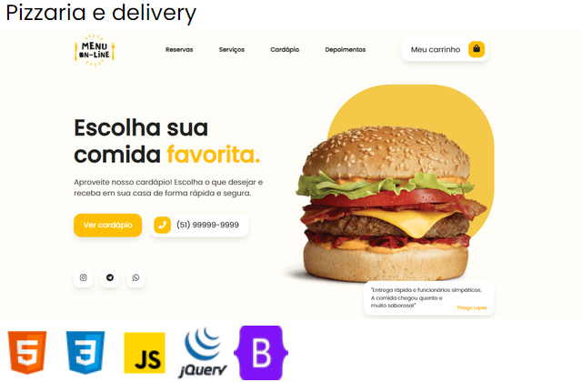
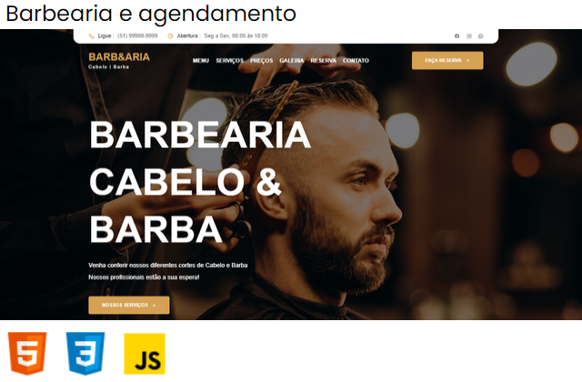
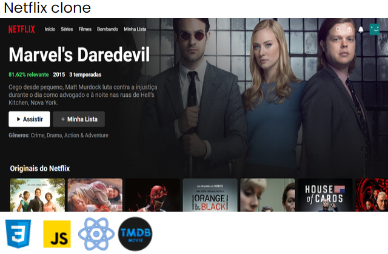

# Welcome to my profile!

Hi! I’m Ezequiel, and I’m a developer who has passion for building clean web applications with intuitive functionalities. I enjoy the process of turning ideas into reality using creative solutions. I’m always curious about learning new skills, tools, and concepts. In addition to working on various solo front-end projects and now I'm studying the Back-end part and UI/UX Design to learn more about web.

I develop simple, intuitive and responsive user interface that helps users get things done with less effort and time with those technologies.

    <a href="https://github.com/Ezequiel-Lee">
        <!--  -->
        
    </a>

## Skills & Tools!

### Technologies - Frameworks - Library

    
    
    
    
    
    
    <!--  -->
    
    <!--  -->
    <!--  -->
    <!--  -->
    <!--  -->
    <!--  -->
    <!--  -->
    <!--  -->
    <!--  -->
    <!--  -->
    <!--  -->
    <!--  -->
    <!--  -->
    <!--  -->
    <!--  -->
    <!--  -->

 

### Tools

    
    
    
    
    
    
    
    <!--  -->
    <!--  -->
    <!--  -->
    <!--  -->
    

 

## The best Projects!

    
    
    <!--  -->

 

## Portifolio

 

## Do You Need a Creative Product for your businesses?
### I can Help You!
#### Social Media! Contact me!

 
    
    <!--  -->
    
    <!--  -->
    <!--  -->

